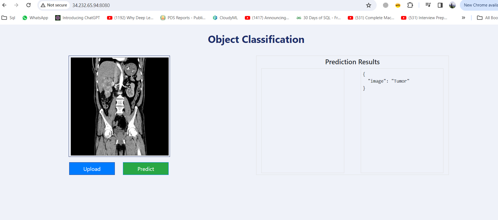
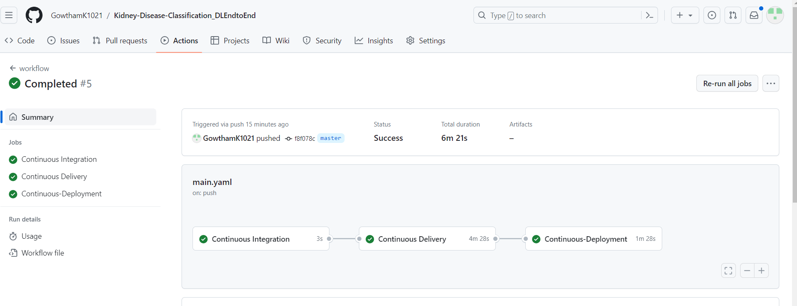
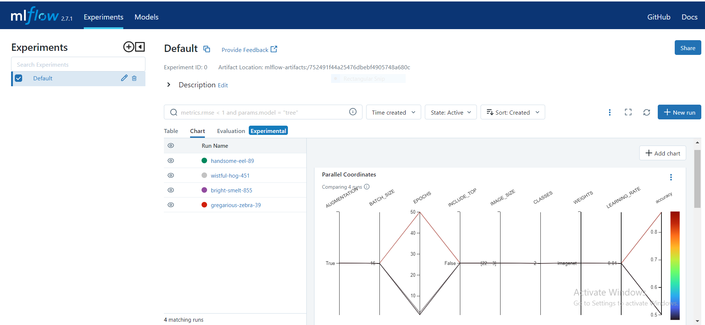
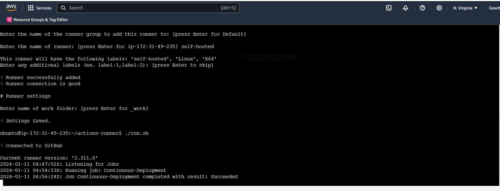
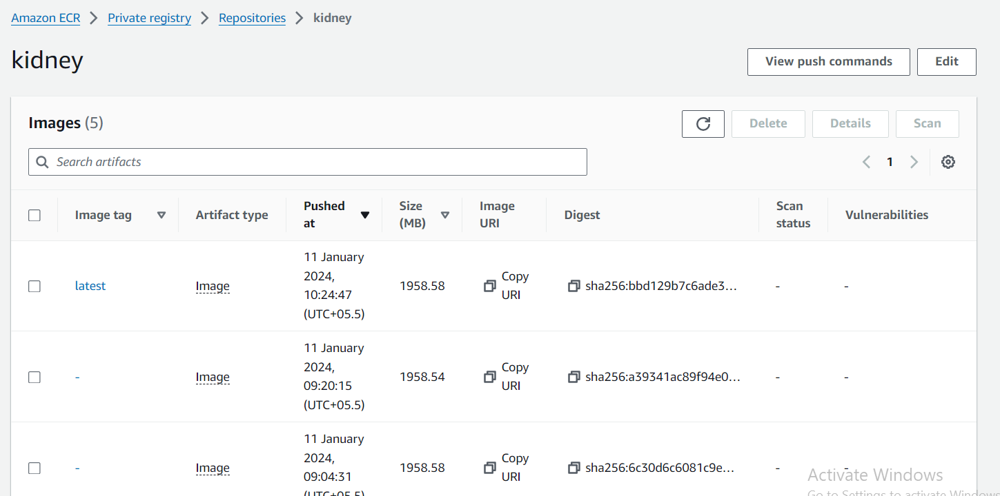
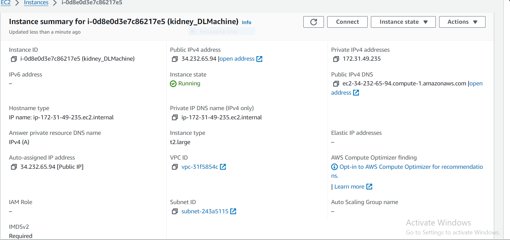
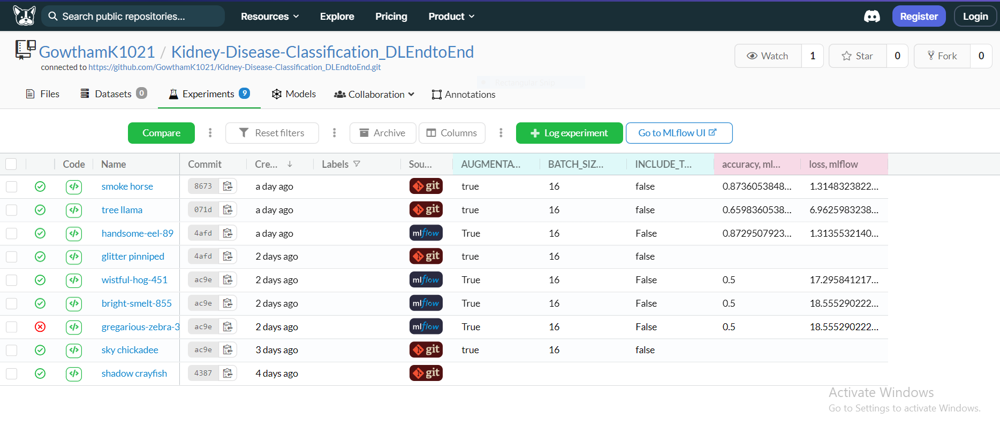

# Kidney-Disease-Classification-MLflow-DVC
## Description: 
Designed and developed a comprehensive end-to-end data science project aimed at detecting kidney tumors using deep learning.Created an intuitive user interface to interact with model.Orchestrated the deployment of the project onto the AWS cloud, implementing a streamlined CI/CD pipeline through GitHub Actions. Leveraged Dagshub to harness the power of MLflow for efficient experimentation and model optimization.
## Problem:
There is a need for a reliable and automated solution that can accurately detect kidney tumors from medical images, thereby improving diagnostic accuracy and patient outcomes.
## Solution:
Developed a robust deep learning model trained on a dataset of kidney tumor images which can accurately identify and classify tumors with accuracy of 87%.
## Technology Stack:
Python,VGG-16,AWS,ECR,EC2,Flask,HTML,MLFlow,Dagshub,DVC,Github Actions,Docker.

## Screenshot:

 



 


## Workflows

1. Update config.yaml
2. Update secrets.yaml [Optional]
3. Update params.yaml
4. Update the entity
5. Update the configuration manager in src config
6. Update the components
7. Update the pipeline 
8. Update the main.py
9. Update the dvc.yaml
10. app.py

# How to run?
### STEPS:

Clone the repository

```bash
https://github.com/GowthamK1021/Kidney-Disease-Classification_DLEndtoEnd
```
### STEP 01- Create a conda environment after opening the repository

```bash
conda create -n myenv python=3.8 -y
```

```bash
conda activate myenv
```


### STEP 02- install the requirements
```bash
pip install -r requirements.txt
```

```bash
# Finally run the following command
python app.py
```

Now,
```bash
open up you local host and port
```


## MLflow

- [Documentation](https://mlflow.org/docs/latest/index.html)

- [MLflow tutorial](https://youtu.be/qdcHHrsXA48?si=bD5vDS60akNphkem)

##### cmd
- mlflow ui

### dagshub
[dagshub](https://dagshub.com/)

MLFLOW_TRACKING_URI=https://dagshub.com/GowthamK1021/Kidney-Disease-Classification_DLEndtoEnd.mlflow \
MLFLOW_TRACKING_USERNAME=GowthamK1021\
MLFLOW_TRACKING_PASSWORD=f4035f79cd1526df260a59004819c15dd71b6ae5 \
python script.py

Run this to export as env variables:

```bash

export MLFLOW_TRACKING_URI=https://dagshub.com/GowthamK1021/Kidney-Disease-Classification_DLEndtoEnd.mlflow

export MLFLOW_TRACKING_USERNAME=GowthamK1021 

export MLFLOW_TRACKING_PASSWORD=f4035f79cd1526df260a59004819c15dd71b6ae5

```


### DVC cmd

1. dvc init
2. dvc repro
3. dvc dag


## About MLflow & DVC

MLflow

 - Its Production Grade
 - Trace all of your expriements
 - Logging & taging your model


DVC 

 - Its very lite weight for POC only
 - lite weight expriements tracker
 - It can perform Orchestration (Creating Pipelines)


# AWS-CICD-Deployment-with-Github-Actions

## 1. Login to AWS console.

## 2. Create IAM user for deployment

	#with specific access

	1. EC2 access : It is virtual machine

	2. ECR: Elastic Container registry to save your docker image in aws


	#Description: About the deployment

	1. Build docker image of the source code

	2. Push your docker image to ECR

	3. Launch Your EC2 

	4. Pull Your image from ECR in EC2

	5. Lauch your docker image in EC2

	#Policy:

	1. AmazonEC2ContainerRegistryFullAccess

	2. AmazonEC2FullAccess

	
## 3. Create ECR repo to store/save docker image
    - Save the URI: 160898663945.dkr.ecr.us-east-1.amazonaws.com/kidney
   

	
## 4. Create EC2 machine (Ubuntu) 

## 5. Open EC2 and Install docker in EC2 Machine:
	
	
	#optinal

	sudo apt-get update -y

	sudo apt-get upgrade
	
	#required

	curl -fsSL https://get.docker.com -o get-docker.sh

	sudo sh get-docker.sh

	sudo usermod -aG docker ubuntu

	newgrp docker
	
# 6. Configure EC2 as self-hosted runner:
    setting>actions>runner>new self hosted runner> choose os> then run command one by one


# 7. Setup github secrets:

    AWS_ACCESS_KEY_ID=

    AWS_SECRET_ACCESS_KEY=

    AWS_REGION = us-east-1

    AWS_ECR_LOGIN_URI = 

    ECR_REPOSITORY_NAME = 

